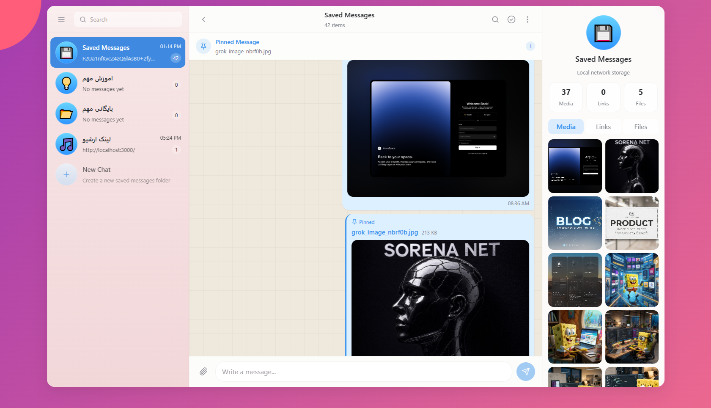
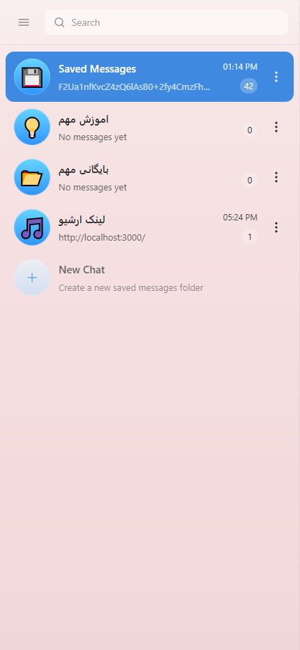
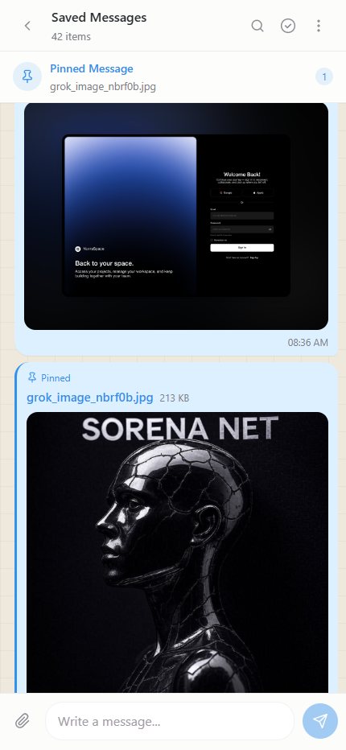
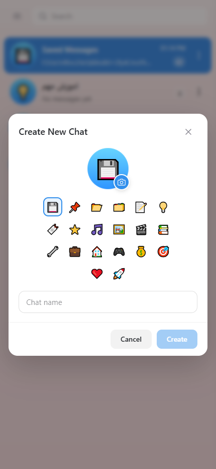

# Local Saved Messages

<p align="center">
  
</p>

---

## 📱 Mobile Preview

<p align="center">
  
  
  
</p>

---

A lightweight, self-hosted web application that replicates Telegram's "Saved Messages" feature. Host it on your home PC and access it from any device on your local network — a universal, real-time clipboard and file-sharing hub.


---

## ✨ Features

- **Real-Time Text Sharing** — Send text messages that instantly appear on all connected devices via Server-Sent Events (SSE).
- **File Upload & Storage** — Upload images, videos, documents, and archives. Files are saved locally on the host machine.
- **Universal Download** — Any device on the network can download uploaded files.
- **Multiple Chats** — Organize messages into separate chats with custom names and emoji avatars.
- **Pin & Save Messages** — Pin important messages or save them for quick access.
- **Auto-Link Detection** — URLs in messages are automatically converted to clickable links.
- **Media & File Tabs** — Browse all shared media, links, and files in dedicated tabs.
- **Drag & Drop / Paste Upload** — Drag files or paste from clipboard to upload.
- **PWA Support** — Install as a standalone app on mobile and desktop.
- **Dark Mode** — Modern glassmorphism UI with dark theme by default.
- **No Authentication** — Designed for trusted local networks; no login required.

---

## 🛠 Tech Stack

| Layer | Technology |
|-------|-----------|
| Framework | [Next.js 15](https://nextjs.org/) (App Router) |
| Language | [TypeScript](https://www.typescriptlang.org/) |
| Styling | [Tailwind CSS 4](https://tailwindcss.com/) |
| Storage | JSON file-based (zero-config, no database server) |
| Real-Time | Server-Sent Events (SSE) |
| PWA | Service Worker + Web Manifest |

---

## 🚀 Getting Started

### Prerequisites

- [Node.js](https://nodejs.org/) 18+ installed on the host machine.

### Installation

```bash
# 1. Clone the repository
git clone https://github.com/your-username/local-saved-messages.git
cd local-saved-messages

# 2. Install dependencies
npm install

# 3. Start the development server
npm run dev
```

The app will be available at `http://localhost:3000`.

### Production Build

```bash
npm run build
npm start
```

### Windows Quick Start

Double-click [`start.bat`](start.bat) — it automatically checks for Node.js, installs dependencies if needed, builds the project, and starts the server.

---

## 🌐 Access from Other Devices

1. Find your host PC's local IP address:
   - **Windows:** Open `cmd` → type `ipconfig` → look for `IPv4 Address` (e.g., `192.168.1.5`)
   - **Linux/macOS:** `ip addr` or `ifconfig`
2. On any device connected to the same Wi-Fi, open:
   ```
   http://<YOUR_IP>:3000
   ```
   Example: `http://192.168.1.5:3000`

> ⚠️ Make sure your firewall allows incoming connections on port `3000`.

---

## 📁 Project Structure

```
.
├── app/
│   ├── api/
│   │   ├── chats/          # Chat CRUD endpoints
│   │   ├── events/         # SSE real-time event stream
│   │   ├── messages/       # Message CRUD endpoints
│   │   └── upload/         # File upload endpoint
│   ├── globals.css
│   ├── layout.tsx
│   └── page.tsx
├── components/
│   └── ChatApp.tsx         # Main chat UI component
├── lib/
│   ├── events.ts           # SSE broadcast/subscribe
│   └── store.ts            # JSON file-based data store
├── public/
│   ├── uploads/            # Uploaded files storage
│   ├── sw.js               # Service Worker (PWA)
│   ├── manifest.json       # PWA manifest
│   └── icon-*.png          # App icons
├── data/                   # JSON database files (auto-created)
├── start.bat               # Windows quick-start script
├── next.config.mjs
├── package.json
└── tsconfig.json
```

---

## 🔌 API Endpoints

| Method | Endpoint | Description |
|--------|----------|-------------|
| `GET` | `/api/messages?chatId=...` | Fetch messages (optionally filtered by chat) |
| `POST` | `/api/messages` | Create a text message |
| `DELETE` | `/api/messages` | Delete messages by IDs |
| `GET` | `/api/messages/[id]` | Get a single message |
| `PATCH` | `/api/messages/[id]` | Update message (pin/save) |
| `GET` | `/api/chats` | List all chats |
| `POST` | `/api/chats` | Create a new chat |
| `PATCH` | `/api/chats/[id]` | Update chat (rename, avatar) |
| `DELETE` | `/api/chats/[id]` | Delete a chat and its messages |
| `POST` | `/api/upload` | Upload a file (multipart/form-data) |
| `GET` | `/api/events` | SSE stream for real-time updates |

---

## 📦 Data Storage

All data is stored as JSON files in the `data/` directory:

- `data/chats.json` — Chat metadata
- `data/messages.json` — All messages

Uploaded files are stored in `public/uploads/`. No external database is required.

---

## 🏠 PWA Installation

On mobile devices, open the app in your browser and use **"Add to Home Screen"** to install it as a standalone app with offline support via the service worker.

---

## 📄 License

MIT © [vidson313](https://github.com/your-username)
